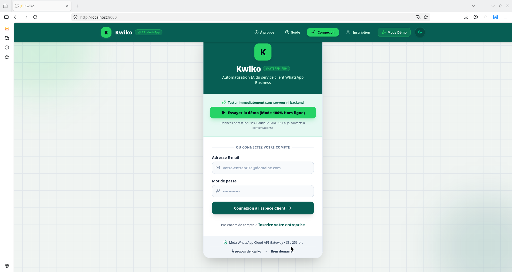
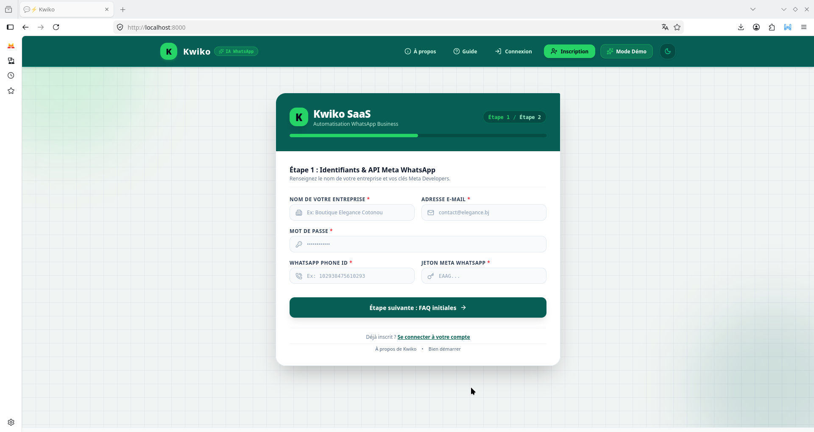
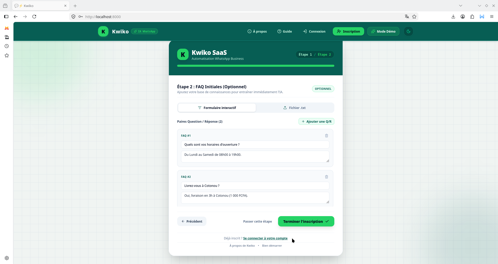

# Kwiko

**Kwiko** est une plateforme qui permet à une PME de brancher son compte **WhatsApp Business** et de laisser une intelligence artificielle répondre automatiquement à ses clients, en s'appuyant sur une base de connaissance de FAQ définie par l'entreprise elle-même.

L'objectif : qu'une petite entreprise qui n'a ni service client 24/7 ni équipe technique puisse, en quelques minutes, avoir un assistant WhatsApp capable de répondre à ses clients de façon pertinente, sans jamais inventer d'information qui ne figure pas dans sa FAQ.

## 📸 Aperçu de l'application (Inscription)

<div style="display: grid; grid-template-columns: repeat(auto-fit, minmax(250px, 1fr)); gap: 1rem;">
  
  
  
</div>

## 🎥 Démonstration vidéo

[](docs/assets/videos/kwiko_video1.webm)

## Sommaire

- [Comment ça marche](#comment-ça-marche)
- [Architecture](#architecture)
- [Stack technique](#stack-technique)
- [Structure du projet](#structure-du-projet)
- [Modèle de données](#modèle-de-données)
- [Prérequis](#prérequis)
- [Installation](#installation)
- [Configuration (variables d'environnement)](#configuration-variables-denvironnement)
- [Lancer le projet](#lancer-le-projet)
- [Configurer le webhook WhatsApp (Meta)](#configurer-le-webhook-whatsapp-meta)
- [Référence API](#référence-api)
- [Tests](#tests)
- [Sécurité — points d'attention](#sécurité--points-dattention)
- [Limitations connues / pistes d'amélioration](#limitations-connues--pistes-daméliorations)
- [Licence](#licence)

## Comment ça marche

1. **Inscription** : une PME crée un compte Kwiko avec le nom de son entreprise, un email/mot de passe, et les identifiants de son numéro WhatsApp Business (`phone_number_id` + `token` fournis par Meta). Elle peut fournir dès l'inscription une première liste de FAQ.
2. **Base de connaissance** : chaque question/réponse (FAQ) fournie par la PME est stockée en base **et** vectorisée (embedding) puis indexée dans un index **FAISS** dédié à cette PME, pour permettre une recherche sémantique rapide.
3. **Réception d'un message WhatsApp** : quand un client final écrit à la PME sur WhatsApp, Meta notifie Kwiko via un **webhook**. Kwiko :
   - identifie la PME concernée à partir du `phone_number_id` ;
   - retrouve ou crée le contact (le client final) ;
   - enregistre le message entrant ;
   - recherche dans l'index FAISS de la PME les FAQ les plus pertinentes par rapport à la question posée ;
   - construit un prompt contenant ces FAQ et interroge un LLM (via l'API **Groq**) pour générer une réponse naturelle basée **uniquement** sur ces informations ;
   - enregistre la réponse générée, puis l'envoie au client final via l'API **WhatsApp Cloud** ;
   - si aucune information pertinente n'est trouvée ou si le LLM est indisponible, une réponse de repli polie est envoyée à la place.
4. **Tableau de bord** : la PME peut se connecter pour consulter ses FAQ, la liste de ses contacts WhatsApp, et l'historique des conversations, ainsi qu'ajouter de nouvelles FAQ à tout moment (le nouvel index est mis à jour automatiquement).

## Architecture

```
Client WhatsApp  <-->  API WhatsApp Cloud (Meta)  <-->  Webhook Kwiko (FastAPI)
                                                              |
                                                              v
                                                     ┌─────────────────┐
                                                     │   DBManager     │  (SQLModel + SQLite async)
                                                     │  Client/Contact │
                                                     │  FAQ / Message  │
                                                     └────────┬────────┘
                                                              │
                                            ┌─────────────────┼─────────────────┐
                                            v                                   v
                                   ┌─────────────────┐               ┌──────────────────┐
                                   │   RAGEngine     │               │    LLMManager     │
                                   │ SentenceTransf. │               │  Groq (cascade    │
                                   │  + index FAISS  │               │  modèles + clés)  │
                                   └─────────────────┘               └──────────────────┘

PME (navigateur) <--> Frontend (React) <--> API REST Kwiko (/api/...)
```

Le backend expose deux surfaces :
- une **API REST** consommée par le frontend web (dashboard PME) ;
- un **webhook** consommé par Meta (réception des messages WhatsApp entrants).

## Stack technique

- **Langage** : Python 3.11+ (usage de `StrEnum`, syntaxe moderne de type hints)
- **API** : FastAPI + Uvicorn (multi-workers), CORS.
- **Base de données** : SQLite en async via `sqlmodel` + `sqlalchemy` (`aiosqlite`), facilement migrable vers Postgres via `KWIKO_DB_URL`
- **Recherche sémantique (RAG)** : `sentence-transformers` (modèle BERT local) + `faiss` (index `IndexIDMap(IndexFlatL2)`)
- **LLM** : API **Groq**, avec cascade de modèles (`llama-3.3-70b-versatile` → fallback `llama-3.1-70b-versatile` → `llama-3.1-8b-instant`) et rotation de plusieurs clés API en cas de rate limit
- **Intégration WhatsApp** : WhatsApp Cloud API (Meta Graph API v20.0) via `httpx`
- **Auth** : JWT (`python-jose`), mots de passe hashés avec `bcrypt`
- **Rate limiting** : `slowapi` (20 requêtes/minute par IP par défaut)
- **Autres** : `nest_asyncio` (compatibilité event loop), gestion propre des signaux d'arrêt (SIGINT/SIGTERM/SIGQUIT)

## Structure du projet

Le code source doit être placé dans un package racine nommé `kwiko` (les imports internes utilisent `from kwiko.backend...`), organisé comme suit :

```
kwiko/
└── backend/
    ├── config.py                # Configuration globale (env, chemins, constantes)
    ├── test_backend.py          # Suite de tests pytest (TestClient) end-to-end de l'API
    ├── test_kwiko_complet.py    # Script de test manuel complet (mode régression + mode réel WhatsApp)
    ├── api/
    │   ├── main_api.py          # Application FastAPI, lifespan, middlewares, routes système
    │   ├── router.py            # Toutes les routes métier /api/...
    │   ├── run_api.py           # Point d'entrée pour lancer le serveur en script autonome
    │   └── whatsapp_client.py   # Client HTTP pour l'envoi de messages WhatsApp Cloud
    ├── core/
    │   ├── db_manager.py        # Modèles SQLModel (Client, Contact, FAQ, Message) + DBManager
    │   ├── llm_manager.py       # Client Groq, cascade de modèles, construction des prompts
    │   └── rag_engine.py        # Encodage d'embeddings + gestion des index FAISS
    └── utils/
        ├── jwt_utils.py         # Création/vérification des tokens JWT
        ├── cryto_utils.py       # Hash/vérification de mot de passe (bcrypt)
        ├── limiter.py           # Instance slowapi partagée
        ├── loop_utils.py        # Exécution sync d'une coroutine (compatible loop déjà active)
        └── signal_manager.py    # Gestion des signaux système pour arrêt propre
```

Un dossier `model/MODEL_BERT/` (modèle `sentence-transformers`) doit être présent à la racine de `backend/` — l'application refuse de démarrer sans lui (voir `config.py`).

## Modèle de données

| Table     | Champs principaux                                                                                     | Relation                          |
|-----------|--------------------------------------------------------------------------------------------------------|------------------------------------|
| `Client`  | `id`, `entreprise_name`, `email` (unique), `password_hash` (exclu des réponses API), `whatsapp_phone_number_id` (unique), `whatsapp_token`, `index_path`, `created_at` | 1 client → N contacts, FAQ, messages |
| `Contact` | `id`, `client_id`, `whatsapp_num` (unique), `name`, `created_at`                                        | 1 contact → N messages              |
| `FAQ`     | `id`, `client_id`, `question`, `response`, `created_at`                                                 | appartient à un client              |
| `Message` | `id`, `contact_id`, `client_id`, `direction` (`entrant`/`sortant`), `contenu`, `wamid` (unique), `faqs_used` (JSON sérialisé), `created_at` | appartient à un contact et un client |

## Prérequis

- Python ≥ 3.11
- Un modèle `sentence-transformers` téléchargé localement dans `backend/model/MODEL_BERT/`
- Un compte **Groq** avec au moins une clé API
- Un compte **Meta for Developers** avec une app WhatsApp Business configurée (`phone_number_id` + token d'accès permanent)
- (Optionnel en prod) une base Postgres si vous ne souhaitez pas rester sur SQLite

## Installation

```bash
git clone https://github.com/hounsoubenny-cyber/kwiko.git kwiko
cd kwiko
python -m venv .venv
source .venv/bin/activate   # Windows : .venv\Scripts\activate

pip install -r requirements.txt
```

`requirements.txt` est généré à partir des imports réels du backend, versions figées sur l'environnement de développement (Python 3.11+). `torch` n'y est pas listé explicitement : il est installé automatiquement comme dépendance de `sentence-transformers` — ne le fixez manuellement que si vous ciblez une variante précise (CPU-only vs CUDA), voir le commentaire en fin de fichier.

Placez votre modèle d'embedding dans `backend/model/MODEL_BERT/` (format `sentence-transformers` standard : `config.json`, `pytorch_model.bin`/`model.safetensors`, fichiers de tokenizer, etc.).

## Configuration (variables d'environnement)

Créez un fichier `.env` à la racine de `backend/` :

```env
# Clés Groq (au moins une, numérotées à partir de 1 — rotation automatique)
GROQ_API_KEY_1=gsk_xxx...
GROQ_API_KEY_2=gsk_yyy...

# Modèle Groq principal (fallback automatique si indisponible)
GROQ_MODEL=llama-3.3-70b-versatile

# Base de données (par défaut : SQLite local dans backend/data/kwiko.db)
KWIKO_DB_URL=sqlite+aiosqlite:///./data/kwiko.db

# JWT
KWIKO_JWT_SECRET=change-moi-en-production
KWIKO_JWT_EXP_MINUTES=60

# Webhook WhatsApp — doit correspondre exactement à ce que vous saisissez
# dans la configuration du webhook sur Meta for Developers
KWIKO_WHATSAPP_VERIFY_TOKEN=un-secret-que-tu-choisis
```

⚠️ **Ne commitez jamais votre `.env`** — ajoutez-le à `.gitignore`. En production, changez impérativement `KWIKO_JWT_SECRET` (la valeur par défaut n'est utilisable qu'en développement).

Côté frontend, `public/config.json` expose deux valeurs au navigateur :
```json
{
  "API_BASE_URL": "http://localhost:8000",
  "WHATSAPP_VERIFY_TOKEN": "un-secret-que-tu-choisis"
}
```
`WHATSAPP_VERIFY_TOKEN` doit être **identique** à `KWIKO_WHATSAPP_VERIFY_TOKEN` côté backend — c'est la valeur affichée au client dans le guide de démarrage (`GettingStartedView`) pour qu'il configure son webhook côté Meta. Cette valeur est **globale à toute la plateforme** (pas un secret par PME) : voir la section Sécurité ci-dessous pour ce que ça implique.

## Lancer le projet

**Option 1 — via Uvicorn directement (rechargement à chaud) :**
```bash
uvicorn kwiko.backend.api.main_api:app --host 0.0.0.0 --port 8000 --reload
```

**Option 2 — via le script `run_api.py`** (gestion des signaux, arrêt propre, boucle de supervision) :
```bash
python -m kwiko.backend.api.run_api
```

Une fois lancé :
- Documentation interactive : `http://localhost:8000/docs`
- Health check : `http://localhost:8000/health`
- Toutes les routes métier sont sous `http://localhost:8000/api/...`

Si un build React est présent dans `frontend/build/` (chemin défini dans `config.py`), le backend le sert directement aux routes `/`, `/static`, `/build` et à toute route non-API (catch-all pour le routing côté client).

## Configurer le webhook WhatsApp (Meta)

Dans votre app Meta for Developers, section WhatsApp > Configuration :
- **Callback URL** : `https://votre-domaine.com/api/webhook`
- **Verify Token** : la même valeur que `KWIKO_WHATSAPP_VERIFY_TOKEN` (affichée automatiquement au client dans le guide de démarrage du dashboard)
- Abonnez-vous au champ `messages`

Meta appelle une seule fois la route en `GET` pour valider l'URL (challenge), puis envoie tous les messages entrants en `POST` sur cette même route.

## Référence API

Base URL : `/api`. Toutes les routes métier sont limitées à **20 requêtes/minute par IP**.

> **Particularité d'authentification** : il n'y a pas de header `Authorization`. Chaque route protégée attend `email`, `password`, et (selon la route) `token` directement dans le **body JSON** de la requête.

| Méthode | Route            | Auth requise            | Description                                              |
|---------|-------------------|--------------------------|------------------------------------------------------------|
| POST    | `/auth/signup`     | —                        | Crée un compte PME, optionnellement avec des FAQ initiales |
| POST    | `/auth/login`      | email + password         | Retourne un `access_token` JWT                              |
| POST    | `/faqs`            | email + password          | Ajoute des FAQ à un compte existant                         |
| POST    | `/faqs/list`       | email + password + token  | Liste les FAQ du compte                                     |
| POST    | `/client/me`       | email + password + token  | Profil complet : client, FAQ, contacts, messages             |
| POST    | `/contacts/get`    | email + password + token  | Détail d'un contact + ses messages                          |
| POST    | `/contacts/list`   | email + password + token  | Liste des contacts du compte                                 |
| POST    | `/messages/get`    | email + password + token  | Détail d'un message                                          |
| POST    | `/token/refresh`   | email + password + token  | Émet un nouveau token JWT                                    |
| GET     | `/webhook`         | verify token Meta         | Validation du webhook (usage interne Meta uniquement)        |
| POST    | `/webhook`         | aucune (voir Sécurité)    | Réception des messages WhatsApp entrants                     |
| GET     | `/health`          | —                        | Statut du service                                            |
| GET     | `/rate-limit-status` | —                      | Diagnostic du rate limiting pour l'IP courante                |

Format attendu pour le champ `faqs` (texte libre, blocs séparés par une ligne vide) :
```
Q: Quels sont vos horaires ?
R: Nous sommes ouverts de 8h à 18h.

Q: Livrez-vous à Cotonou ?
R: Oui, sous 24h.
```

Toute erreur renvoie un body `{"detail": {"message": "...", "error": "..."}}` exploitable directement par le frontend.

## Tests

Le projet contient deux scripts de test, avec des rôles différents :

- **`test_backend.py`** — suite `pytest` automatisée (`pytest test_backend.py -v`). Tourne en isolation totale : base SQLite en mémoire, appels Groq et envois WhatsApp mockés (rapide, gratuit, ne dépend d'aucun réseau externe). C'est celui à lancer en CI ou avant chaque commit.
  > ⚠️ `router.py` garde `DB_MANAGER`/`RAG_ENGINE`/`LLM_MANAGER` en singletons globaux (créés une seule fois par processus — un bon choix en production pour éviter de recharger le modèle d'embedding à chaque requête). Ça casse l'isolation par défaut entre tests `pytest` (un seul processus, donc un seul singleton partagé). Le fixture `client` réinitialise explicitement ces trois globales avant chaque test pour garantir une vraie isolation, indépendante de l'ordre d'exécution.
- **`test_kwiko_complet.py`** — script de validation manuelle de bout en bout, à lancer contre une **vraie instance en cours d'exécution** (`uvicorn ... --port 8000`). Utilise la vraie base de données configurée, le vrai moteur RAG, un vrai appel Groq, et optionnellement un vrai envoi WhatsApp (mode réel, via variables d'environnement dédiées). Inclut aussi un simulateur interactif en fin de script pour discuter avec le bot comme un client WhatsApp. C'est le test à faire avant de considérer une évolution du backend comme prête pour un vrai déploiement.

En résumé : `test_backend.py` valide que le code est correct rapidement et à moindre coût ; `test_kwiko_complet.py` valide que le système fonctionne réellement de bout en bout, services externes réels compris.

## Sécurité — points d'attention

- `password_hash` est explicitement exclu des sérialisations (`exclude=True` sur le champ) — bonne pratique déjà en place.
- Le mécanisme d'auth (email + password envoyés en clair à **chaque** requête protégée, en plus du token) implique que le mot de passe transite sur le réseau bien plus souvent qu'avec un schéma classique "token seul dans un header" — à n'utiliser qu'en HTTPS strict.
- **`POST /webhook` n'est actuellement authentifié par rien** : le `verify_token` ne s'applique qu'à la vérification initiale (`GET /webhook`, une seule fois côté Meta), jamais aux messages entrants réels. N'importe qui connaissant l'URL du webhook et un `phone_number_id` déjà enregistré pourrait donc envoyer un faux payload et le faire traiter comme un vrai message client. La protection standard côté Meta est la vérification de la signature `X-Hub-Signature-256` (HMAC calculé avec l'**App Secret** de l'app Meta du client) — non implémentée pour l'instant. Voir la section Limitations ci-dessous.

## Limitations connues / pistes d'amélioration

- **Pas de vérification de signature sur le webhook** (`X-Hub-Signature-256`) : à ce stade, `POST /webhook` fait confiance à tout payload reçu qui ressemble à un message WhatsApp valide, sans vérifier qu'il provient réellement de Meta. Pour corriger : stocker l'App Secret de chaque client en base (nouveau champ), puis recalculer et comparer le HMAC du body reçu avant tout traitement. Accepté comme limitation connue pour la portée actuelle du projet (pas de données sensibles en jeu), à traiter en priorité avant tout usage commercial réel.
- Le MVP ne traite que les messages **texte** WhatsApp (images/audio ignorés, cf. `_handle_single_message`).
- Un seul utilisateur par entreprise (pas de gestion d'équipe/rôles).
- Pas de réponse manuelle possible depuis le dashboard (l'IA répond seule, ou le message reste sans réponse en cas d'échec du LLM).
- SQLite convient pour un MVP mais devra migrer vers Postgres pour un usage multi-PME à plus grande échelle (le code est déjà compatible via `KWIKO_DB_URL`).
- Le `WHATSAPP_VERIFY_TOKEN` est unique et global à toute la plateforme (pas un secret par PME) — cohérent avec le fonctionnement de Meta (un seul token par app, quel que soit le nombre de numéros WhatsApp rattachés), mais à garder en tête si l'architecture évolue.

